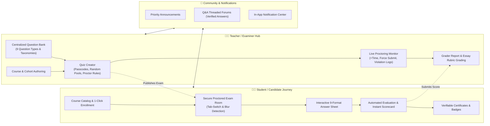
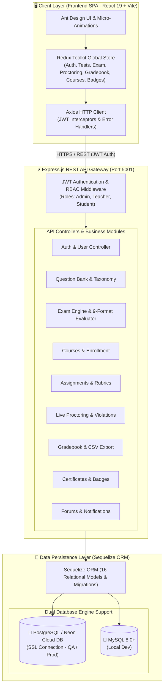

# 🎓 Pariksha - Full-Featured Test & Assessment LMS Platform

A production-ready, full-stack **Pariksha Learning & Assessment Management System (Moodle-compatible)** built with **React**, **Redux Toolkit**, **Ant Design (antd)**, **Node.js with Express**, and **Sequelize ORM with MySQL & PostgreSQL**.

---

## 🗺️ Application Ecosystem & User Flow Diagram



---

## 🌟 Comprehensive Moodle Modules & Features

### 🏛️ 1. Centralized Question Bank & Taxonomy

- **Hierarchical Categories**: Organize questions by subjects and difficulty levels (Easy, Medium, Hard).
- **Import to Quiz & Random Pools**: Add specific questions or pull random question sets by category and count directly into exams.
- **Export & Backup**: Export question banks to structured JSON for backup and course portability.

### 🧩 2. Complete 9 Question Formats Engine

1. **Single Choice (MCQ)**: Single correct option with automated score evaluation.
2. **Multiple Choice (Multi-Select)**: Multiple correct checkboxes with partial and full credit grading.
3. **True / False**: Fast binary knowledge checks.
4. **Short Answer**: Case-sensitive or case-insensitive keyword and phrase matching.
5. **Matching Pairs**: Interactive dual-column source-to-target dropdown pair matching.
6. **Numerical with Tolerance**: Mathematical and scientific questions with exact value $\pm$ tolerance ranges.
7. **Cloze / Fill-in-the-Blanks**: Text passages with multi-blank inputs auto-evaluated against acceptable answers.
8. **Essay / Open-Response**: Long-form answers with multi-criteria rubric evaluation and teacher feedback drawers.
9. **Ordering / Sequence**: Drag or position sequence questions checking chronological or algorithmic order.

### 📚 3. Courses & Cohorts Management

- **Course Catalog**: Course codes, descriptions, difficulty levels, and enrolled student counts.
- **Student Self-Enrollment**: 1-click self-enrollment and access to course quizzes, assignments, and discussions.
- **Teacher Course Management**: Create, edit, and organize quizzes and assignments per course.

### 📝 4. Assignments & Homework Activities

- **Assignment Authoring**: Title, instructions, attachments, maximum points, and due dates.
- **Student Submissions**: Text answers and file attachment submission tracking with overdue status flags.
- **Rubric Grading Engine**: Teachers grade submissions with multi-criteria rubrics (e.g. Accuracy, Depth, Presentation) and custom comments.

### 🛡️ 5. Quiz Security & Browser Proctoring Integrity

- **Passcode Protection**: Restrict quiz access with secure access passwords.
- **Attempt Limits**: Configure single-attempt or multi-attempt rules with highest/average score retention.
- **Tab-Switch & Focus-Loss Monitor**: Real-time browser blur tracking with persistent violation logs and warning modals.

### 📡 6. Teacher Live Exam Monitoring Hub

- **Real-Time Student Tracker**: Monitor in-progress student exams, time remaining, question progress, and proctoring violations.
- **Time Extensions**: Add emergency $+5$ or $+10$ minutes in real time.
- **Proctor Actions**: Force-submit or disqualify students caught violating integrity guidelines.

### 📊 7. Moodle Grader Report & Gradebook

- **Gradebook Matrix**: Unified view of all student scores across all quizzes and assignments.
- **Weighted GPA**: Automated percentage and grade calculation per student.
- **Manual Essay Grading Drawer**: Seamless workflow to inspect and score essay questions with instant grade recalculation.
- **1-Click CSV Export**: Download grade reports directly into spreadsheet formats.

### 🏆 8. Verifiable Certificates & Digital Badges

- **Official Certificates of Completion**: Auto-generated on passing exam threshold with unique verification code, issuing authority, and printable view.
- **Gamification Badges**: Earn achievements like _Quiz Master_, _Perfect 100_, _First Step_, and _Discussion Star_.

### 📢 9. Announcements & Q&A Discussion Forums

- **Priority Announcements**: Urgent, Important, and General broadcast updates for course members.
- **Interactive Discussion Forums**: Threaded discussions with upvoting and teacher "Verified Answer" badges.
- **In-App Notification Center**: Real-time bell notifications for new assignments, graded exams, and announcements.

---

## 🚀 Quick Demo Credentials

| Role               | Email              | Password      |
| :----------------- | :----------------- | :------------ |
| **Teacher**        | `teacher@test.com` | `password123` |
| **Student (Alex)** | `student@test.com` | `password123` |
| **Student (Emma)** | `emma@test.com`    | `password123` |

> 💡 _On the login page, you can use the **1-Click Demo Login** buttons to instantly sign in without typing!_

---

## 🛠️ Tech Stack & System Architecture



- **Frontend**: React 19, Vite, Redux Toolkit (`@reduxjs/toolkit`, `react-redux`), Ant Design (`antd`, `@ant-design/icons`), React Router v6, Axios, Dayjs, Canvas-Confetti.
- **Backend**: Node.js, Express.js, Sequelize ORM, PostgreSQL (`pg`, `pg-hstore`) & MySQL (`mysql2`), JSON Web Tokens (`jsonwebtoken`), Bcryptjs (`bcryptjs`), CORS, Dotenv.
- **Database (PostgreSQL / MySQL)**:
  - **QA / Production**: PostgreSQL on Neon Cloud DB via `DATABASE_URL` / `DATABASE_URL_POOLED` (`NODE_ENV=qa`)
  - **Local Development**: MySQL (`test_platform_db`) or local PostgreSQL
  - **16 Relational Models**:
    - `User`, `Course`, `CourseEnrollment`
    - `QuestionCategory`, `Question`, `Option`
    - `Test`, `Submission`, `SubmissionAnswer`
    - `Assignment`, `AssignmentSubmission`
    - `Certificate`, `Badge`, `UserBadge`
    - `Announcement`, `ForumTopic`, `ForumPost`, `Notification`

---

## ⚙️ How to Run Locally

### 1. Prerequisites

- Node.js (v18+)
- PostgreSQL (e.g. Neon cloud connection) OR MySQL (v8.0+ / port 3306)

### 2. Backend Setup

```bash
cd backend
npm install

# Seed the database with complete Moodle demo data (works for PostgreSQL and MySQL):
npm run seed

# Start backend server (runs on http://localhost:5001):
npm start
```

### 3. Frontend Setup

```bash
cd frontend
npm install

# Start Vite React dev server (runs on http://localhost:5173):
npm run dev
```

### 4. Running Automated End-to-End Test Suite

```bash
cd backend
node src/scripts/test_e2e.js
```

_All 20 E2E test suites validate question banks, 9 question types evaluation, course enrollments, rubric grading, proctoring events, CSV gradebook exports, certificates, and forums._
